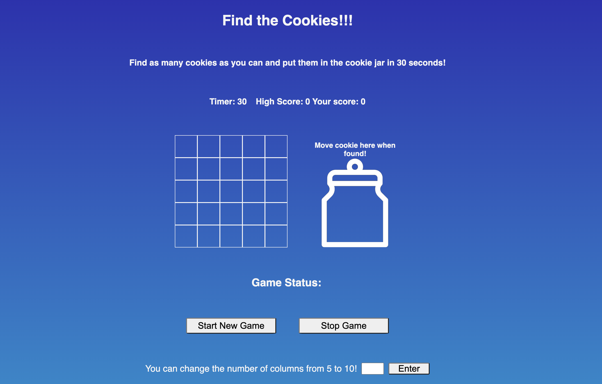

# hit-buzzer-win-cookie

### Game may be played here: [https://nicholas-riegel.github.io/hit-buzzer-win-cookie/](https://nicholas-riegel.github.io/hit-buzzer-win-cookie/)

## Description

* User has to try to find as many cookies as possible in 30 seconds. 
* User wins if they find at least one cookie in the time limit.
* User loses if they don't find any cookies in the time limit.
* On larger screens user must then click and drag the found cookie to the cookie jar. 
* On larger screens user can make the game harder by increasing the number of columns from 5 to 10.
* On smaller screens dragging is not optimal so cookie moves to the jar automatically when found. 
* On smaller screens ability to increase number of columns is removed due to size constrains, however game is still fully functional. 
